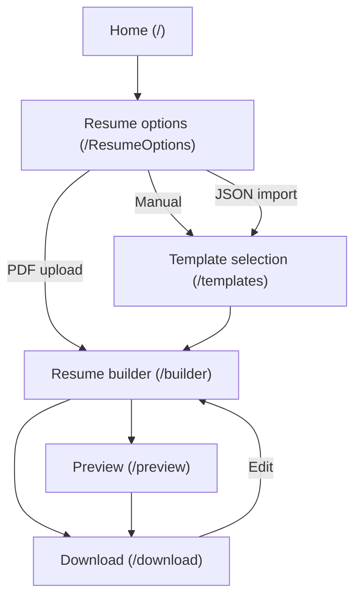
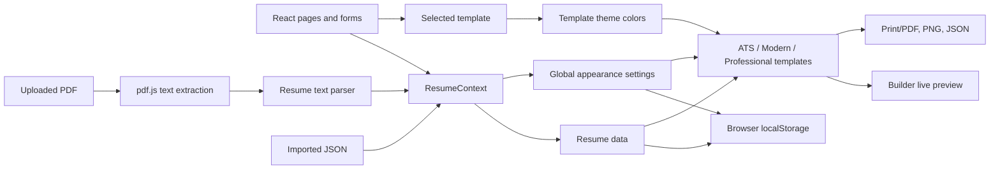

# AI Resume Builder

A browser-based resume builder built with React, Vite, and Tailwind CSS. Users can create a resume manually, import resume data from JSON, or extract text from a PDF, then edit the result, choose a template, customize its appearance, preview it, and export it.

## Getting started

Requirements: Node.js and npm.

```bash
npm install
npm run dev
```

Vite prints the local development URL when the server starts.

Useful scripts:

| Command | Purpose |
| --- | --- |
| `npm run dev` | Start the Vite development server |
| `npm run build` | Run the TypeScript project build and create the production bundle |
| `npm run lint` | Run ESLint |
| `npm run preview` | Serve the built bundle locally |

## User workflow

1. **Start a resume** from the home page using **Create Resume**.
2. **Choose an input method** on `/ResumeOptions`:
   - **Create manually** starts with the resume form.
   - **Upload Resume** extracts text from a PDF in the browser and maps recognized content into resume fields. PDF parsing is heuristic, so review and correct the imported fields.
   - **Import JSON** loads a previously exported resume-data JSON file. A sample JSON file can be downloaded from this screen.
3. **Select a template** on `/templates` when that step is part of the chosen flow. Available templates are ATS Friendly, Modern, and Professional.
4. **Edit and preview** on `/builder`. Edit personal information, summary, skills, experience, education, projects, certifications, awards, and languages. Toggle optional sections and use the live preview.
5. **Customize the resume** with the toolbar. Typography opens global body/heading font and font-size settings; Change Color opens the global color controls. Appearance settings are stored in browser local storage.
6. **Preview and export** from `/preview` or `/download`. The download screen supports printing/saving as PDF, exporting PNG, and exporting resume data as JSON.

## Application workflow



## System design



### Main components

- **Routing:** `src/routes/AppRoutes.jsx` maps the application URLs to their page components.
- **State:** `src/context/ResumeContext.jsx` shares resume content and global appearance settings across the React app. Resume edits are mirrored to `resumeData` in local storage; appearance settings are stored under `resumeAppearance` and loaded when the app starts.
- **Template selection:** `src/pages/SelectTemplate.jsx` stores the selected template and its initial theme. Template definitions and default colors live in `src/templates/config/`.
- **Resume rendering:** `src/templates/` contains the ATS, Modern, and Professional layouts and their reusable content sections. The ATS layout uses `src/components/PaginatedResume.jsx` to split the two-column resume into preview pages and show page breaks.
- **Preview route note:** The `/preview` page currently renders the ATS template. The builder and download screens use the selected template.
- **Appearance:** `src/components/AppearanceSettingsModal.jsx` edits global fonts, font scale, and colors. `src/utils/resumeAppearance.js` applies the selected color overrides to each template's theme.
- **PDF import:** `src/utils/extractPdfText.js` uses pdf.js to read PDF text in the browser. `src/utils/parseResumeText.js` uses text patterns and section headings to populate resume fields; it is not an AI/cloud parsing service.
- **Export:** `src/pages/Download.jsx` uses `react-to-print` for PDF/print, `html-to-image` for PNG, and `file-saver` for JSON.

There is no server database or cross-device sync. Resume edits are written to browser local storage, but the current app starts resume state from its initial data instead of restoring `resumeData` on reload. Export resume data as JSON to keep a copy or move it between browsers; appearance settings are restored from browser storage.

## Project structure

```text
src/
  components/   Shared UI, toolbar, pagination, and settings modal
  context/      Shared resume and appearance state
  data/         Initial resume data and sample JSON
  forms/        Resume editing forms
  pages/        Home, options, builder, preview, and download screens
  routes/       React Router configuration
  templates/    Resume layouts, sections, themes, and template options
  utils/        PDF extraction, text parsing, export helpers, appearance
```
